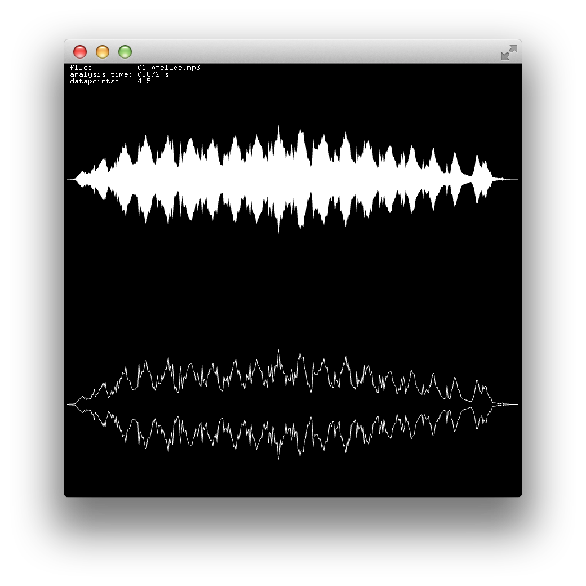

ofxAvCodec
===

So... what is it?  
A small wrapper around libavcodec - the magic library that is painful to use, but basically the only cross platform way to read and write in many different media formats. 

### Good

* Uses FFmpeg (Supports linux,osx,ios,windows,windows phone and android. Lots of different formats -- wav,mp3,ogg,flac,mp4,etc.)
* You get access to the raw buffer data
* Classes to read and write streaming audio
* Built-in resampling
* A class to read and update metadata
* Waveform extract for previews

### Bad

* Uses FFmpeg
* Mostly (?) memory leak free
* Licensing is a bit tricky (ffmpeg is lgpl, dynamic linking necessary!)

# Instructions 

1. Clone this repository in your addons folder
2. Download the latest binary release from https://github.com/kritzikratzi/ofxAvCodec/releases
3. Take the `lib` folder from the zip and copy it to `addons\ofxAvCodec\libs\avcodec\`

## Windows

* Use the project generator and add the ofxAvCodec library. Then open in VS
* Right click your solution, select properties. Make sure to have the *all configurations* option selected. 
* `Configuration > Linker > Extended > SAFESH:NO` 
  set to no (if you cant find the option add `/SAFESEH:NO` as a custom linker flag)
* Still in VS, navigate to  
  `emptyExample > addons > ofxAvCodec > libs > avcodec` 
  `Right click > Add Elements > Add existing elements`  
  Add all .lib files from addons/ofxAvCodec/libs/avcodec/lib/vs/Win32 (or x64)

# Examples

## Example Read

`ofxAvAudioPlayer` can read an audio file and prepare it for playback through openframeworks audio callback. Before loading the sound you can tell the player your preferred number of output channels and samplerate, all the resampling and channel conversions are done automatically. 

	class ofApp : public ofBaseApp{
		// ...
		ofSoundStream soundStream;
		ofxAvAudioPlayer player;
		void audioOut( float * output, int bufferSize, int nChannels );
	};
	
	//--------------------------------------------------------------
	void ofApp::setup(){
		soundStream.setup(this, 2, 0, 44100, 512, 4);
		player.setupAudioOut(2, 44100); // required to resample properly
		player.loadSound(ofToDataPath("testo.flac"));
		map<string,string> metadata = player.getMetadata(); 
	}

	void ofApp::audioOut( float * output, int bufferSize, int nChannels ){
		player.audioOut(output, bufferSize, nChannels); 
	}

## Example Write

`ofxAvAudioWriter` needs to be set up with a sample rate and number of channels. After that you can open the file and start writing samples into it. Don't forget to close the file when you are done! 

	ofxAvAudioWriter writer;
	writer.setup(44100, 1); // 44.1kHz, 1 channel
	writer.addMeta("title", "my cool song"); 
	writer.open(ofToDataPath("testo.wav"), "wav" );
	
	int N = 100; // use an odd buffer size. just to show that we can! 
	float * buffer = new float[N];
	int num = 0;
	
	// write roughly 3000 samples in chunks of size N
	while( num < 3000 ){
		for( int i = 0; i < N; i++ ){
			buffer[i] = sinf(num*TWO_PI*400/44100.0);
			num ++;
		}
		writer.write(buffer, N);
	}
	cout << "wrote " << num << " samples" << endl;
	writer.close();

## Metadata Read/Update

	// Read metadata without reading the file
	map<string,string> meta = ofxAvUtils::read("myfile.wav"); 
	
	// Write metadata without re-encoding the file 
	// this still reads and writes the entire file though! 
	map<string,string> myMeta; 
	myMeta["title"] = "careless whisper"; 
	ofxAvMetadata::update("myfile.wav", myMeta ); 

## Waveform preview

	int resolution = 100; // number of datapoints
	int width = 400; // display width
	int heigt = 100; // display height
	ofPath path = ofxAvUtil::waveformAsPath(filename, resolution, width, height);
	path.draw();
	
	// alternatively you can get the waveform data directly 
	float * amplitudes = ofxAvUtil::waveform(filename, resolution); 
	// now do something funny with it
	delete amplitudes; 
	

# License

libavcodec comes with a GPL/LGPL license. For convenience the precompiled binaries are included (compiled as shared libs, gpl plugins not enabled). I hope I made no mistake, FFmpeg maintains a hall of shame and you and I don't want to end up there. To be safe you could make your own build. To do so follow the notes in ffmpeg_src/readme.txt. 

The license of this plugin itself is the MIT License, or the WTFPL. Have your pick. Either way, I do appreciate credits. 